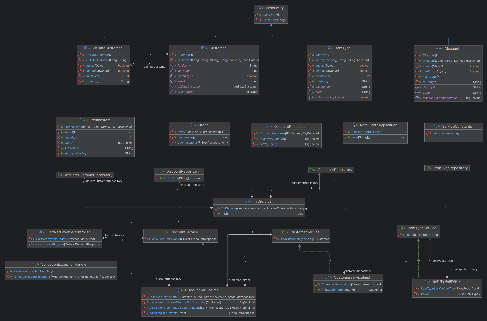
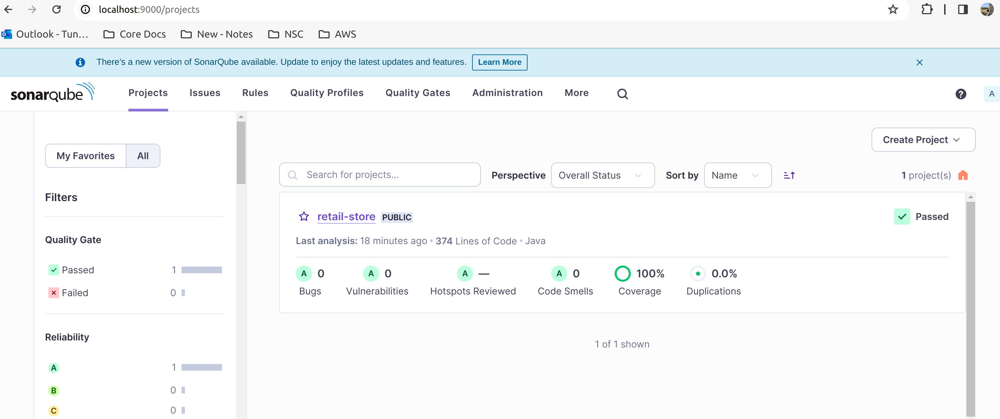

# Retail Store
This application calculates the Net Payable of an order after applying the
maximum discount applicable on the order

# Assumptions
1. User is valid and already logged in
2. Discount percentages to be made easily modified
3. Whether a user is an employee of the store is already captured
4. Inclusion and exclusion of Item types(groceries, electronics etc) to be made easily modified

# Getting Started

This application is written in Java 17 using Spring boot 3.2.2 and H2 Database.
Below are the tools used

1. Gradle as the build tool
2. Jacoco for test and coverage reports
3. Sonarqube for static code analysis and coverage report monitoring
4. api docs for API documentation

# Commands to use :
Run the below command to clean and build the application, this will install the
required dependencies, run the tests and creates the jar file in build folder

    gradle clean build

Run the below command to run the tests, generates test report and jacoco code coverage report.
Test report gets generated in build/reports/ and coverage report in build/jacocoHtml.

Simple POJOs like dtos, entities and data initiation service InitService are excluded from code coverage

    gradle test jacocoTestReport

Run the below command to run the sonar analysis, make sure sonar is running and
update the sonar.host.url and sonar.token accordingly in build.gradle file

    gradle sonar

Run the below command to start the application

    gradle bootrun

# API Documentation :
Once the application is started, swagger API documentation is available at http://localhost:8080/swagger-ui/index.html

# Project UML Diagram :

# Sonar Report :
